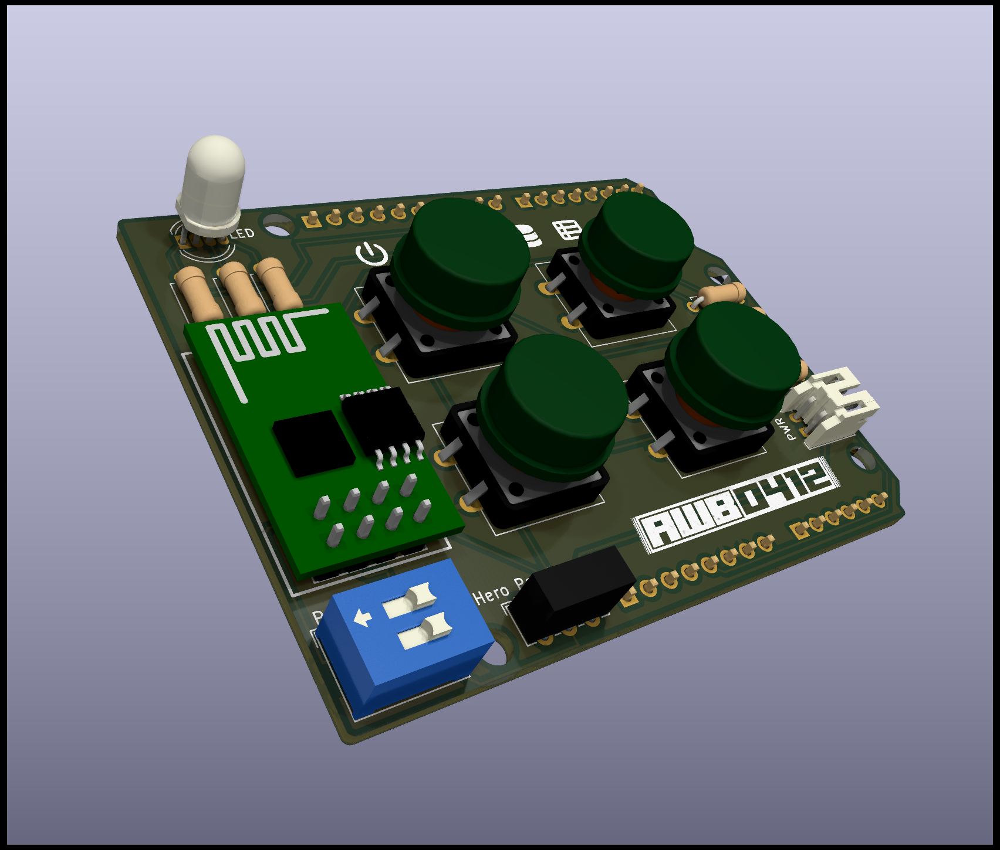
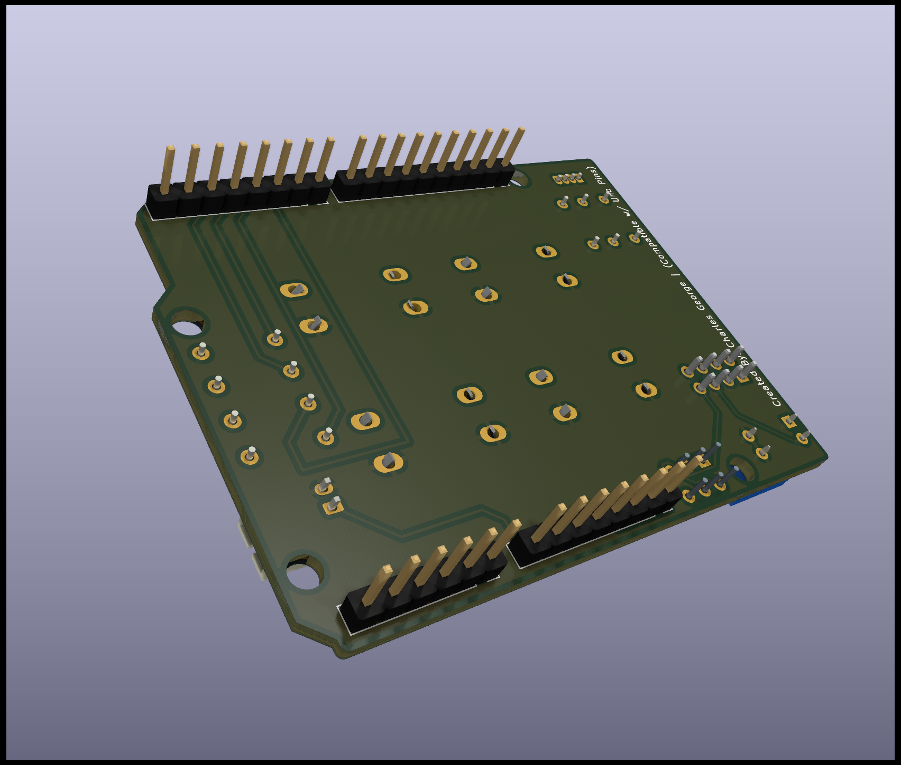
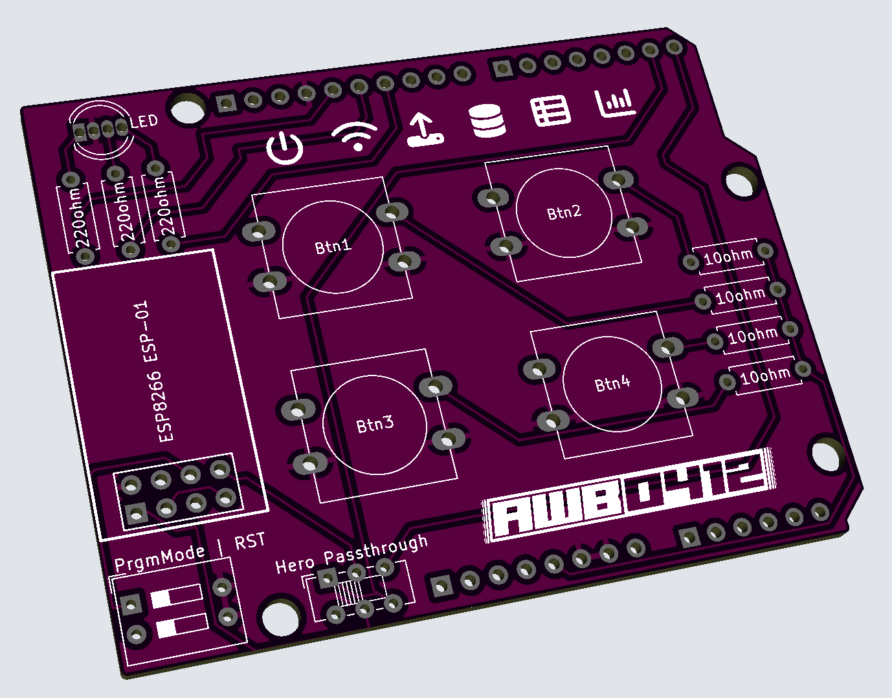

<a name="readme-top"></a>

<!-- PROJECT LOGO -->
<br />
<div align="center">
  <a href="https://github.com/87designer/arduino_infant_tracker">
    
  </a>

  <p align="center">
    <br />
    <!-- <a href="https://github.com/87designer/arduino_infant_tracker"><strong>Explore the docs »</strong></a>
    <br />
    <br />
    <a href="https://github.com/87designer/arduino_infant_tracker">View Demo</a> -->
  </p>
</div>


<!-- TABLE OF CONTENTS -->
<details>
  <summary>Table of Contents</summary>
  <ol>
    <li>
      <a href="#about-the-project">About The Project</a>
      <ul>
        <li><a href="#built-with">Built With</a></li>
      </ul>
    </li>
    <li>
      <a href="#getting-started">Getting Started</a>
      <ul>
        <li><a href="#prerequisites">Prerequisites</a></li>
        <li><a href="#installation">Installation</a></li>
      </ul>
    </li>
    <li><a href="#usage">Usage</a></li>
    <li><a href="#roadmap">Roadmap</a></li>
    <li><a href="#acknowledgments">Acknowledgments</a></li>
  </ol>
</details>


<!-- ABOUT THE PROJECT -->
## About The Project

Categorical Data Logging Wifi Button (Arduino Uno Shield Design)

<div style="display:flex">
     <div style="flex:1;padding-right:10px;">
          
     </div>
     <div style="flex:1;padding-left:10px;">
          
     </div>
</div>

ADD DESCRIPTION (Talk about inspriation, and Inventr class providing skills to bring this project to life.)

<div style="display:flex">
     <div style="flex:1;padding-right:10px;">
          
     </div>
</div>

<p align="right">(<a href="#readme-top">back to top</a>)</p>


### Built With

* [![Arduino][Arduino]][Arduino-url]
* [![C++][Cplusplus]][Cplusplus-url]
* [![Kicad][KiCad]][KiCad-url]
* [![Google Sheets][googlesheets]][googlesheets-url]
* [![Google Apps Script][appsscript]][appsscript-url]

<p align="right">(<a href="#readme-top">back to top</a>)</p>


<!-- GETTING STARTED -->
## Getting Started

Explain the overall functionality
Explain switch configurations

### Prerequisites

* Arudino IDE Installed
* Appropriate Drivers Installed
* ESP Libraries installed
* Google Sheet Setup
* Javascript Web App Deployed

### Materials:
  * 1 x [Arduino Hero](https://github.com/inventrkits/HERO)
  * 1 x A-Male to B-Male USB Cable
  * 1 x [ESP8266](https://en.wikipedia.org/wiki/ESP8266) ESP-01 Wifi Module
  * 1 x AWB-0412 Arduino Uno Shield PCB
  * 1 x Pin Headers (1x10)
  * 2 x Pin Headers (1x08)
  * 1 x Pin Headers (1x06)
  * 4 x 10ohm Resistor
  * 3 x 220ohm Resistor
  * 1 x RGB LED
  * 4 x 12mm Tactile Button
  * 1 x [EG1271](https://www.digikey.com/en/products/detail/e-switch/EG1271/251335) DPDT Switch Slide
  * 1 x [78B02ST](https://www.digikey.com/en/products/detail/grayhill-inc/78B02ST/726238) DIP Switch Slide


### Installation

<!-- Write about install/uploading the code for hero & wifi module-->

ADD DESCRIPTION (installation commands around uploading code to the Hero & Wifi Module)
1. Step one description to go here
2. Example Installation Commands
   ```
   Commands
   ```

<p align="right">(<a href="#readme-top">back to top</a>)</p>


<!-- USAGE EXAMPLES -->
## Usage

ADD DESCRIPTION (Usage example of the wifi button being used as an Infant Tracker... diapers, feedings, sleep schedule etc.)

<p align="right">(<a href="#readme-top">back to top</a>)</p>


<!-- ROADMAP -->
## Roadmap

- [x] Breadboard Prototype to test functionality
  - 
- [x] Document Prototype in hobby CAD software (Tinkercad / Fritzing)
  - 
- [x] Electronic Design Automation (EDA), and 
    - [x] Schematic Capture
      - 
    - [x] PCB Layout with Gerber output
      - 
- [ ] Develop Final button commands
- [ ] Draft Documentation
- [ ] Assemble Shield & Test Hardware
- [ ] Finalize Documentation
- [ ] Design / Fabricate a Housing possibly 3D printed model


<p align="right">(<a href="#readme-top">back to top</a>)</p>


<!-- ACKNOWLEDGMENTS -->
## Acknowledgments

* []() Add Inventr acknowledgement for 
* []() Add google sheet code acknowledgement
* []() Add ESP8266 Tutorial acknowledgement
* []() Add README file acknowledgement here

<p align="right">(<a href="#readme-top">back to top</a>)</p>


<!-- MARKDOWN LINKS & IMAGES -->
<!-- https://www.markdownguide.org/basic-syntax/#reference-style-links -->
[Arduino]: https://img.shields.io/badge/arduino-00979D?style=for-the-badge&logo=arduino&logoColor=white
[Arduino-url]: https://www.arduino.cc/
[Cplusplus]: https://img.shields.io/badge/C++-00599C?style=for-the-badge&logo=cplusplus&logoColor=white
[Cplusplus-url]: https://en.wikipedia.org/wiki/C%2B%2B
[KiCad]: https://img.shields.io/badge/KiCad-314CB0?style=for-the-badge&logo=kicad&logoColor=white
[KiCad-url]: https://www.kicad.org/
[googlesheets]: https://img.shields.io/badge/Google%20Sheets-34A853?style=for-the-badge&logo=googlesheets&logoColor=white
[googlesheets-url]: https://www.google.com/sheets/about/
[appsscript]: https://img.shields.io/badge/Google%20Apps%20Script-4285F4?style=for-the-badge&logo=googledrive&logoColor=white
[appsscript-url]: https://www.google.com/script/start/
