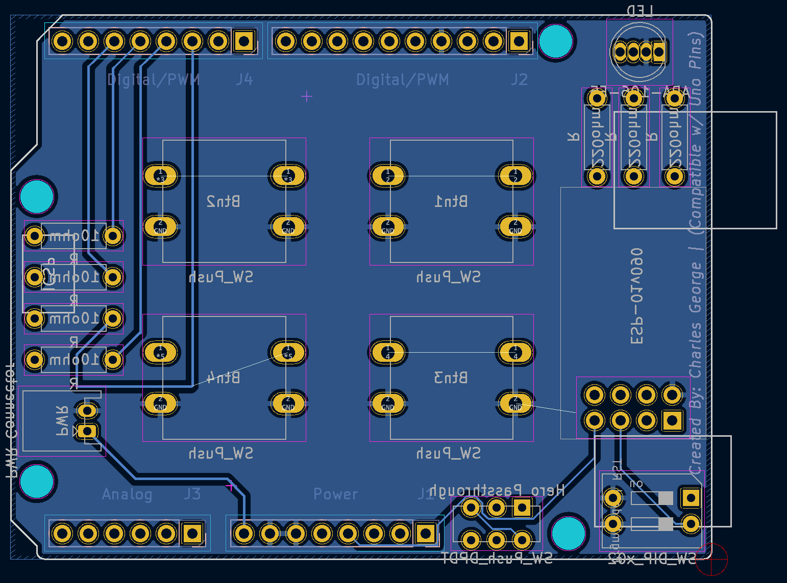

<a name="readme-top"></a>

<!-- PROJECT LOGO -->
<br />
<div align="center">
  <a href="https://github.com/87designer/arduino_infant_tracker">
    
  </a>

  <p align="center">
    <br />
    <!-- <a href="https://github.com/87designer/arduino_infant_tracker"><strong>Explore the docs »</strong></a>
    <br />
    <br />
    <a href="https://github.com/87designer/arduino_infant_tracker">View Demo</a> -->
  </p>
</div>


<!-- TABLE OF CONTENTS -->
<details>
  <summary>Table of Contents</summary>
  <ol>
    <li>
      <a href="#about-the-project">About The Project</a>
      <ul>
        <li><a href="#built-with">Built With</a></li>
      </ul>
    </li>
    <li>
      <a href="#getting-started">Getting Started</a>
      <ul>
        <li><a href="#prerequisites">Prerequisites</a></li>
        <li><a href="#installation">Installation</a></li>
      </ul>
    </li>
    <li><a href="#usage">Usage</a></li>
    <li><a href="#roadmap">Roadmap</a></li>
    <li><a href="#acknowledgments">Acknowledgments</a></li>
  </ol>
</details>


<!-- ABOUT THE PROJECT -->
## About The Project

After being introduced to Arduino and electronics through the "30 Days Lost in Space" Adventure Kit from Inventr, I was served a social media ad for a small consumer button device that logged events to a dashboard, via wifi. Seeing how I could potentially leverage a device like this in my day to day, my gears got to turning.

```
Arduino + New Electronic Skills = I can make that
```

And with that, the AWB0412 categorical data logging wifi button was born. *(as an Arduino Uno Shield)*

When the device is powered on the LED in the top left will be red. After successful network connectino has been made, the LED will turn Green. When a Button is pressed the LED will blink blue.

There are 4 buttons on the shield giving the ability to log up to 12 different types of events using the methods of single click, double click, & hold +1 second for each button.

<br>
<hr>

#### 3D Model with Components *(Designed using KiCad)*

<div style="display:flex">
     <div style="flex:1;padding-right:10px;">
          
     </div>
     <div style="flex:1;padding-left:10px;">
          
     </div>
</div>

<br>
<hr>

#### PCB *(Vendor Mockup from Gerber files)*

<div style="display:flex">
     <div style="flex:1;padding-right:10px;">
          
     </div>
</div>

<p align="right">(<a href="#readme-top">back to top</a>)</p>


### Built With

* [![Arduino][Arduino]][Arduino-url]
* [![C++][Cplusplus]][Cplusplus-url]
* [![Kicad][KiCad]][KiCad-url]
* [![Google Sheets][googlesheets]][googlesheets-url]
* [![Google Apps Script][appsscript]][appsscript-url]

<p align="right">(<a href="#readme-top">back to top</a>)</p>


<!-- GETTING STARTED -->
## Getting Started

### Prerequisites

1) Install the [Arudino IDE](https://www.arduino.cc/en/software) on your computer
2) Install appropriate [Drivers](https://inventr.io/drivers/) for the Hero board
3) Install [ESP Libraries](https://github.com/esp8266/Arduino)
4) [Configure Cloud](https://www.youtube.com/watch?v=fS0GeaOkNRw) storage and app
    - Setup a Google Sheet to accept the timestamps and categories.
    - Deploy Google Apps Script code to listen for category request and write it to the google sheet.

### Materials:
  * 1 x [Arduino Hero](https://github.com/inventrkits/HERO)
  * 1 x A-Male to B-Male USB Cable
  * 1 x [ESP8266](https://en.wikipedia.org/wiki/ESP8266) ESP-01 Wifi Module
  * 1 x AWB-0412 Arduino Uno Shield PCB
  * 1 x Pin Headers (1x10)
  * 2 x Pin Headers (1x08)
  * 1 x Pin Headers (1x06)
  * 4 x 10ohm Resistor
  * 3 x 220ohm Resistor
  * 1 x RGB LED
  * 4 x 12mm Tactile Button
  * 1 x [EG1271](https://www.digikey.com/en/products/detail/e-switch/EG1271/251335) DPDT Switch Slide
  * 1 x [78B02ST](https://www.digikey.com/en/products/detail/grayhill-inc/78B02ST/726238) DIP Switch Slide


### Installation

<!-- Write about install/uploading the code for hero & wifi module-->

After construction of the Shield is complete, mount the shield to the Arduino and connect to your computer using the compatible USB cable to power on.

1. Open up the Arduino IDE and ensure the correct Board and Port are selected.
2. With all switches on the shield in the operating position, upload a [blank sketch]() to the Arduino.
3. Power down / disconnect the USB cable and slide DPDT switch and top DIP switch *(this will enable programming mode for the wifi module when powered is restored)*.
5. Reconnect the USB and change the board assignment in the IDE to the ESP8266 wifi module *(the port should be the same so ensure it is still assigned)*
6. Upload the [wifi sketch]() to the ESP8266.
7. Once the sketch is finished uploading, slide the top DIP switch on and off to reset the wifi module.
8. Power down / disconnect the USB cable and return all switches to operating position.
9. Reconnect the USB and change the board assignment in the IDE back to the Arduino.
10. Upload the [button sketch]() to the Arduino.
11. Once the sketch is finished uploading, power down / disconnect the USB cable from the computer and the device is ready to operate from an appropriate power source (battery, wall plug, usb cable.)

<p align="right">(<a href="#readme-top">back to top</a>)</p>


<!-- USAGE EXAMPLES -->
## Usage

#### Infant Tracker

One usage example of the AWB0412 wifi button shield would be as an Infant Tracker to help sleep deprived parents keep track of diapers, feedings, sleep schedule etc.

<p align="right">(<a href="#readme-top">back to top</a>)</p>


<!-- ROADMAP -->
## Roadmap

- [x] Breadboard Prototype to test functionality<br>
  
- [x] Document Prototype in hobby CAD software (Tinkercad / Fritzing)<br>
  
- [x] Electronic Design Automation (EDA), and 
    - [x] Schematic Capture<br>
      
    - [x] PCB Layout with Gerber output<br>
      <div style="display:flex">
        <div style="flex:1;padding-right:10px;">
          
        </div>
        <div style="flex:1;padding-right:10px;">
          
        </div>
      </div>
- [ ] Develop Final button commands
- [ ] Develop Method of Powering Device
- [ ] Draft Documentation
- [ ] Assemble Shield & Test Hardware
- [ ] Finalize Documentation
- [ ] Design / Fabricate a Housing possibly 3D printed model


<p align="right">(<a href="#readme-top">back to top</a>)</p>


<!-- ACKNOWLEDGMENTS -->
## Acknowledgments

* Special shoutout to the [Inventr]() Adventure Kit for laying the foundation for electronics that helped bring this project to life.
* [LogMaker360](https://www.youtube.com/watch?v=fS0GeaOkNRw) Youtube video walkthrough on how to get arduino to write to google sheets.
* [Electronics Hub](https://www.electronicshub.org/esp8266-arduino-interface/) Great article with detailed information regarding the ESP8266 ESP-01
* [Best-README-Template](https://github.com/othneildrew/Best-README-Template)

<p align="right">(<a href="#readme-top">back to top</a>)</p>


<!-- MARKDOWN LINKS & IMAGES -->
<!-- https://www.markdownguide.org/basic-syntax/#reference-style-links -->
[Arduino]: https://img.shields.io/badge/arduino-00979D?style=for-the-badge&logo=arduino&logoColor=white
[Arduino-url]: https://www.arduino.cc/
[Cplusplus]: https://img.shields.io/badge/C++-00599C?style=for-the-badge&logo=cplusplus&logoColor=white
[Cplusplus-url]: https://en.wikipedia.org/wiki/C%2B%2B
[KiCad]: https://img.shields.io/badge/KiCad-314CB0?style=for-the-badge&logo=kicad&logoColor=white
[KiCad-url]: https://www.kicad.org/
[googlesheets]: https://img.shields.io/badge/Google%20Sheets-34A853?style=for-the-badge&logo=googlesheets&logoColor=white
[googlesheets-url]: https://www.google.com/sheets/about/
[appsscript]: https://img.shields.io/badge/Google%20Apps%20Script-4285F4?style=for-the-badge&logo=googledrive&logoColor=white
[appsscript-url]: https://www.google.com/script/start/
